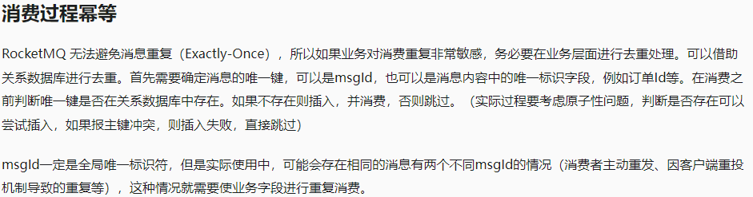

# 1. MQ 的基础概念

## 什么是MQ？

**MQ 全称为 Message Queue 即为 消息队列**

- `消息队列`   是在消息队列的传输过程中保存消息的容器
- 它是经典的：生产者 ------- 消费者

生产者不断向消息队列中生产消息 ------------------------ 消费者不断的从队列中获取信息

**好处：**

- 生产者只需要关注发消息，消费者只需要关注收消息
- 没有 业务逻辑 侵入，这样就没实现了生产者和消费者的解耦


## 为什么要使用 MQ？

简而言之：**削峰限流、异步调用、服务解耦**


## AMQP 和 JMS 消息队列协议

**AMQP 和 JMS 是目前市面上常见的两种 `消息队列协议` **

- #### AMQP `高级消息队列协议`

  是应用层协议的一个开放标准，为面向消息中间件设计，兼容 JMS `RabbitMQ 就是基于 AMQP 协议实现的`

- #### JMS

  - JMS `Java 消息服务`

    JMS 的客户端之间可以通过 JMS 服务进行异步的消息传输

  - JMS（Java Message Service，Java 消息服务）API 是一个消息服务的标准或是规范

    `就像 JDBC 一样通过接口定义一组规范，不同的实现对于的驱动来完成开发`

    它使分布式通信耦合度更低，消息服务更加可靠以及异步性，**ActiveMQ 就是就与 JMS 规范实现的**

> #### 总结
>
> **规范：**
>
> - AMQP：为消息定义了线路层（wire-level-protocol）的协议
> - JMS：所定义的是 API 规范
>
> **跨平台：**
>
> - Java 体系中，多个 client 均可以通过 JMS 进行交互，不需要应用修改代码，但是其对跨平台的支持较差
> - AMQP 天然具有 跨平台、跨语言特性
>
> **支持消息类型：**
>
> - JMS：支持 TextMessage、MapMessage 等复杂的消息类型
> - AMQP：仅支持 byte[] 消息类型（复杂的类型可序列后发送）
>
> **Exchange `交换机` 提供的路由算法：**
>
> - AMQP：可以提供多样化的路由方式来传递消息到消息队列 **4种交换机类型，6种模式**
> - **JMS 仅支持 队列 和 主题/订阅 方式两种**
>
> **常见 MQ 产品：**
>
> - ActiveMQ：基于 JMS，`早期的MQ框架，现在已经很少使用了`
> - Kafka：分布式消息系统，高吞吐量
> - RabbitMQ：基于 AMQP 协议，erlang 语言开发，稳定性好
> - RocketMQ：基于 JMS，阿里巴巴产品，目前交由 Apache 基金会


## 几种常见MQ的对比：

|            | **RabbitMQ**            | **ActiveMQ** ×                 | **RocketMQ** | **Kafka**  |
| ---------- | ----------------------- | ------------------------------ | ------------ | ---------- |
| 公司/社区  | Rabbit                  | Apache                         | 阿里         | Apache     |
| 开发语言   | Erlang                  | Java                           | Java         | Scala&Java |
| 协议支持   | AMQP，XMPP，SMTP，STOMP | OpenWire,STOMP，REST,XMPP,AMQP | 自定义协议   | 自定义协议 |
| 可用性     | 高                      | 一般                           | 高           | 高         |
| 单机吞吐量 | 一般                    | 差                             | 高           | 非常高     |
| 消息延迟   | 微秒级                  | 毫秒级                         | 毫秒级       | 毫秒以内   |
| 消息可靠性 | 高                      | 一般                           | 高           | 一般       |

追求可用性：Kafka、 RocketMQ 、RabbitMQ
追求可靠性：RabbitMQ、RocketMQ
追求吞吐能力：RocketMQ、Kafka
追求消息低延迟：RabbitMQ、Kafka


# 2. RabbitMQ

> 记的比较少，可以参考我的git：https://gitee.com/lyfdadwa/rabbitmq-strudy

## 基础概念

- RabbitMQ是基于Erlang语言开发的开源消息通信中间件，官网地址：https://www.rabbitmq.com/
- 基于 `AMQP` (Advanced Message Queue 高级消息队列 `协议`) 协议实现的消息队列
- 它是一种应用程序之间的通信方式，消息队列在分布式系统开发种应用非常广泛


### RabbitMQ 工作原理


**组成部分：**

1. **Producer 消息队列**

- 消息生产者，即生产方客户端，生产方客户端，生产方客户端将消息，`通过信道 Channel 发送到MQ`

2. **Connection 连接对象**

- Producer / Consumer 和 broker 之间的 TCP 连接：

  程序通过，Connection 连接对象将，创见出 `Channel 信道：生产者通过 信道 将消息发送给 MQ 消费者通过 信道 获取到 MQ 的消息`

- Channel 信道：

  如果每一次访问 RabbitMQ 都建立一个 Connection，消息量大的时候，对于性能也是巨大的。

  Channel 是在 connection 内部建立的逻辑连接，为 Connection 减少了操作系统建立 TCP connection 的开销，`细节不详细介绍`

  **可以理解为是一个，消息数据传递的一个 `通道` **

  **可以通过它，来创建配置，`生产者|消费者 与 MQ 通信 声明设置绑定：交换机|队列`**

3. **Broker `可以认为是 MQ`**

- `消息队列服务进程`： 此进程包括两部分：Exchange交换机 和 Queue队列

- Exchange 交换机

  是 RabbitMQ 非常重要的一个部分

  一方面它接收来自生产者的消息，另一方面它将消息 推送到队列中

- Queue 队列

  RabbitMQ 内部使用的一种数据结构 `队列`  `队列就像是一种”吸管“ 一遍吸水一边出水，遵循”先进先出“原则`

  生产者消息 ----- 交换机 ----- 转发到队列上 `是真正存储消息的地方`

4. **Consumer 消息消费者**

- 消息消费者，即消费方客户端，`通关信道 Channel` 接收 MQ 转发的消息，并进行相关的处理

> ----- 发送消息 ------
>
> - 生产者通过 Connection 和 Broker 建立 TCP 连接
> - Connection 建立 Channel 通道
> - 生产者通过信道，将消息发送给 Broker（MQ），由 Exchange 将消息进行转发~`队列中去！`
>
> ----- 接收消息 ------
>
> - 消费者通过 Connection 和 Broker 建立 TCP 连接
> - Connection 建立 Channel 通道
> - 消费者监听指定的 Queue（队列），当有消息到达 Queue 时 Broker 默认将消息，通过 Channel 推送给消费者


### Exchange 交换机四种类型

**RabbiMQ 消息传递模型的核心思想是：**

- 生产者永远不会将任何消息直接发送到队列，通常生产者甚至不知道消息是否会被传递到任何队列 **生产者只能向交换机（Exchange）发送消息**
- 交换机是一个非常简单的东西，一边接收来自生产者的消息，另一边将消息推送到队列
- RabbitMQ 的交换机具有很多种类型，可以完成很多种复杂的场景操作

**交换机类型：**

- **fanout：**广播模式 `发布/订阅`，交换机给所有的队列，发送相同的消息

- **direct：**路由模式 `routing key` 交换机，根据对应的 `routing key` 的队列上发送消息

- **topic：**动态路由模式，可以用过一定规则定义 `routing key` 使 **交换机动态的多样性选择** 队列

  `*  表示一个单词`

  `#  表示任意数量（零个或多个）单词`

- **headers：** 请求头模式，`目前用的很少了`，就像请求头一样，发送消息时附带 `头部数据` ，交换机根据消息的头部信息匹配对应的队列


## 基本配置

1. 直接利用 docker 下载安装（先拉镜像：docker pull rabbitmq:3.8-management）：

```powershell
docker run \
 -e RABBITMQ_DEFAULT_USER=xiaoyu \
 -e RABBITMQ_DEFAULT_PASS=xiaoyu \
 -v mq-plugins:/plugins \
 --name mq \
 --hostname mq \
 -p 15672:15672 \
 -p 5672:5672 \
 -d \
 rabbitmq
```

2. 程序中引入依赖：

```xml
        <!--AMQP依赖，包含RabbitMQ-->
        <dependency>
            <groupId>org.springframework.boot</groupId>
            <artifactId>spring-boot-starter-amqp</artifactId>
        </dependency>
```

3. 搞一个虚拟主机(在控制面板上做, 创建用户,给用户分配这个新的虚拟主机), 隔离环境
4. yml 配置

- 生产者配置:

```yml
logging:
  pattern:
    dateformat: MM-dd HH:mm:ss:SSS
  level:
    com.ly.: debug
spring:
  rabbitmq:
    host: 192.168.197.135 #虚拟机ip
    port: 5672 #端口
    virtual-host: /xiaoyu #虚拟主机
    username: xiaoyu #用户名
    password: xiaoyu #密码
    connection-timeout: 1s #连接超时时间
    template: #连接失败重试 阻塞式重试(对业务性能有要求的，建议 禁用)
      retry:
        enabled: true # 开启消费者失败重试
        multiplier: 1 # 失败后下次等待时长倍速，下次等待时长=initial-interval*multiplier
        initial-interval: 1000ms # 失败后的初始等待时间
        max-attempts: 3 # 最大重试次数
    publisher-confirm-type: correlated # 开启消息确认机制(不建议开，消耗性能)
    publisher-returns: true #开启消息返回机制(不建议开，消耗性能)

#  这里`publisher-confirm-type`有三种模式可选：
#
#- `none`：关闭confirm机制
#- `simple`：同步阻塞等待MQ的回执
#- `correlated`：MQ异步回调返回回执
# 一般我们推荐使用`correlated`，回调机制。
```

- 消费者配置:

```yml
logging:
  pattern:
    dateformat: MM-dd HH:mm:ss:SSS
spring:
  rabbitmq:
    host: 192.168.197.135 #虚拟机ip
    port: 5672 #端口
    virtual-host: /xiaoyu #虚拟主机
    username: xiaoyu #用户名
    password: xiaoyu #密码
    listener:
      simple:
        prefetch: 1 # 每次只能获取一条消息，处理完成才能获取下一条消息
        acknowledge-mode: auto #自动确认 ack
        retry:
          enabled: true # 开启消费者失败重试
          initial-interval: 1000ms # 初始的失败等待时长为 1s
          multiplier: 1 # 失败的等待时长倍数，下次等待时长 = multiplier * last-interval
          max-attempts: 3 # 最大重试次数
          stateless: true # true无状态；false有状态。如果业务中包含事务，这里改为 false
```


## 基本使用

### 1. 最原始的方式(了解):

这种就无需上述配置了，但是必须手动的创建队列和交换机（也可以利用 Bean 声明）**反正就是需要使用的队列和交换机必须存在**，这里不会默认创建

代码示例:

- 生产者:

```java
import com.rabbitmq.client.Channel;
import com.rabbitmq.client.Connection;
import com.rabbitmq.client.ConnectionFactory;
import org.junit.Test;

import java.io.IOException;
import java.util.concurrent.TimeoutException;

public class PublisherTest {
    @Test
    public void testSendMessage() throws IOException, TimeoutException {
        // 1.建立连接
        ConnectionFactory factory = new ConnectionFactory();
        // 1.1.设置连接参数，分别是：主机名、端口号、vhost、用户名、密码
        factory.setHost("192.168.197.135");
        factory.setPort(5672);
        factory.setVirtualHost("/xiaoyu");
        factory.setUsername("xiaoyu");
        factory.setPassword("xiaoyu");
        // 1.2.建立连接
        Connection connection = factory.newConnection();

        // 2.创建通道Channel
        Channel channel = connection.createChannel();

        // 3.创建队列
        String queueName = "simple.queue";
        channel.queueDeclare(queueName, false, false, false, null);

        // 4.发送消息
        String message = "hello, rabbitmq!";
        channel.basicPublish("", queueName, null, message.getBytes());
        System.out.println("发送消息成功：【" + message + "】");

        // 5.关闭通道和连接
        channel.close();
        connection.close();

    }
}
```

- 消费者(消费者需要一直阻塞监听):

```java
import com.rabbitmq.client.*;
import java.io.IOException;
import java.util.concurrent.TimeoutException;

public class ConsumerTest {

    public static void main(String[] args) throws IOException, TimeoutException {
        // 1.建立连接
        ConnectionFactory factory = new ConnectionFactory();
        // 1.1.设置连接参数，分别是：主机名、端口号、vhost、用户名、密码
        factory.setHost("192.168.197.135");
        factory.setPort(5672);
        factory.setVirtualHost("/xiaoyu");
        factory.setUsername("xiaoyu");
        factory.setPassword("xiaoyu");
        // 1.2.建立连接
        Connection connection = factory.newConnection();

        // 2.创建通道Channel
        Channel channel = connection.createChannel();

        // 3.创建队列
        String queueName = "simple.queue";
        channel.queueDeclare(queueName, false, false, false, null);

        // 4.订阅消息
        channel.basicConsume(queueName, true, new DefaultConsumer(channel){
            @Override
            public void handleDelivery(String consumerTag, Envelope envelope,
                                       AMQP.BasicProperties properties, byte[] body) throws IOException {
                // 5.处理消息
                String message = new String(body);
                System.out.println("接收到消息：【" + message + "】");
            }
        });
        System.out.println("等待接收消息。。。。");
    }
}
```


### 2. 声明式（注解式）

1. #### 通过 Bean 的方式注入声明（了解）

2. #### 直接利用 @RabbitListener 注解声明并监听（必会）

直接参考我的代码吧：https://gitee.com/lyfdadwa/rabbitmq-strudy


## 知识点整理

### RabbitMQ 是什么？它有哪些主要应用场景？

RabbitMQ 是一个开源的消息代理软件，它实现了高级消息队列协议（AMQP），用于在分布式系统种传递消息，RabbitMQ 允许应用程序之间解耦，提供了可靠的消息传递和高可用的消息队列。

RabbitMQ 的主要应用场景：

- 异步处理：将繁重的任务异步化处理，提高系统的响应速度
- 工作负载分发：可以将任务分发给多个消费之，提高工作效率和系统的吞吐量
- 事件驱动架构：使用消息队列来触发和通知不同的系统组件，构建松耦合的系统
- 实时数据流处理：适用于流数据处理应用，通过消息队列接收和处理实时数据

> 扩展知识
>
> 1. RabbitMQ 的关键特性：
>
> - **持久化：** RabbitMQ 可以将消息存储在磁盘上，防止数据丢失
> - **高可用性：** RabbitMQ 支持集群模式和镜像队列，确保在节点故障时系统仍然可用
> - **灵活的路由机制：** RabbitMQ 提供交换器（Exchange）来灵活控制消息到队列的路由，可用根据不同的路由规则实现不同的消息分发策略
>
> 2. 实际应用场景：
>
> - **电商系统：** 在下单高峰时，将订单处理任务异步化处理，提高系统响应速度
> - **日志处理系统：** 收集大量分布式系统的日志数据，用消息队列来保证日志数据的可靠接收和处理
> - **微服务架构：** 在微服务架构中，服务间的通信可用通过消息队列进行解耦，提高系统的可用性和可扩展性


### RabbitMQ 的基本架构是什么？包括哪些核心组件？

RabbitMQ 的基本架构著有由以下核心组件组成：

1. Producer （生产者）：负载发送消息到交换机
2. Exchange （交换机）：接受并路由消息到队列，根据绑定键将消息分配到一个或多个队列
3. Queue （队列）：消息的存储地点，消费者从队列中读取消息
4. Consumer （消费者）：接受并处理队列中的消息
5. Binding （绑定）：定义交换机和队列之间的路由规则
6. Routing Key （路由键）：用于交换机到队列的路由规则
7. Virtual Host （虚拟主机）：逻辑分组，用于隔离不同应用的资源
8. Connection （连接）：RabbitMQ 的客户端与服务器之间的网络连接
9. Channel （信道）：在连接中的虚拟连接，进行消息的读写操作

> 扩展知识
>
> RabbitMQ 不仅是一种简单的消息队列，它还能支持多种复杂的消息路由和分发模式，比如 Direct、Fanout、Topic、Headers等。
>
> **以下说明这些路由类型：**
>
> - Direct Exchange（直连交换机）：根据精确的路由键发送消息绑定的队列，适用于点对点的消息传输， `直接 1对1 精确匹配`
> - Fanout Exchange（扇出交换机）：不考虑路由键，把消息广播道所有绑定的队列，适用于广播的消息传递，如日志系统 ，`广播，只要连了该交换机，所有队列都发`
> - Topic Exchange（主题交换机）：根据模型匹配的路由键发送消息。如果希望某些队列能接收某些特定模式的消息，可用使用通配符形式的路由键。适用于发布/订阅 模式，例如新闻分类 ，`主题 topic ，匹配，连了该交换机的队列，只要满足设置的主题就发`
> - Headers Exchange （头交换机）：根据消息的头部信息中的键值对来匹配，消息将被路由到匹配的队列。对比 Topic 更加灵活，但性能较差 ，`跟主题类似，匹配`
>
> **除此之外 RabbitMQ 还提供了多种高级功能，如：**
>
> - **消息持久化：** 保证消息在 RabbitMQ 重启后不会丢失
> - **Confirm 模式：** 生产者可以通过该模式确认消息已被 RabbitMQ 正常处理
> - **死信队列（Dead Letter Queue）：**消息在超时或被拒绝后存储的队列，用于后续处理。
> - **延时队列（Delayed Queue）：** 支持消息在一定时间后再进行消费


### 如何在 RabbitMQ 中声明一个队列？有哪些必要参数？

在 RabbitMQ 中声明一个队列通常使用 `queueDeclare` 方法，它有几个必要参数：

1. 队列名称：可以指定名称，也可以留空，RabbitMQ 将生成一个唯一的队列名称。
2. 是否持久化（durable）：设置为 true 表示在服务器重启后队列依然存在。
3. 是否排他（exclusive）：设置为 true 表示该队列只能被声明它的连接使用，并在连接断开时自动删除。
4. 是否自动删除（autoDelete）：设置为 true 表示当最后一个消费者断开连接后，队列自动删除。
5. 额外参数（arguments）：用于扩展其它高级功能（比如 TTL、DLX）

> 扩展知识
>
> **消息确认机制：** RabbitMQ 中有一种消息确认（Acknowledgement）机制，当消费者成功处理完消息后，会发送确认信号到 RabbitMQ，这样 RabbitMQ 可以将该消息从队列中移除。如果没有收到确认信号，RabbitMQ 会重新将消息分发给其他消费者。


### 在 RabbitMQ 中，如何确保消息不会丢失？

在 RabbitMQ 中，为了确保消息不会丢失，可以从以下几个方面入手：

1. **消息持久化：** 确保队列和消息都是持久化的，即使 RabbitMQ 服务器重启也不会丢失消息。创建队列的时候设置 `durable` 为 `true`，发布消息时设置 `delivery_mode` 为 `2`.
2. **发布确认：** 开启发布确认模式（Publisher Confirms）。这种模式下，生产者会等待服务器确认响应，确保消息已经成功存储。
3. **消息确认：** 使用明确的消费者确认机制（Acknowledgements）。消费者在处理完消息后，会给 RabbitMQ 发送确认，RabbitMQ 在收到确认后才会将消息从队列中删除。

> 另外：
>
> - **合理设置重试策略：** 如果消费者无法处理消息，一定要有适当的重试机制，避免消息未处理就删除。
> - **消息复制：** 将消息复制到多个节点，提高容错性。我们可以利用 RabbitMQ 的集群功能来实现这一点。


### 如何在 RabbitMQ 中实现消息的持久化？

1. 定义持久化队列
2. 将消息标记为持久化

> 扩展知识
>
> - **持久化队列**：声明队列的时候将 `durable` 参数设置为 `true`
>
> - **持久消息**： 发送消息的时候，将消息的 `delivery_mode` 属性设置为 `2`，确保消息是持久化的，这确保消息在进入持久化队列的时候不会丢失。
>
> - **交换器的持久化（Durable Exchange）**： 如果你的消息需要通过交换器路由到队列，那么你还需要保证你的交换器也是持久化的。
>
> - **磁盘写入策略**： RabbitMQ 提供了多种磁盘写入策略来保证不同程度的持久化性能，应根据业务需求选择合适的策略。
>
>   比如：`lazy Queue` 模式可以适用于消息积压较多的场景。
>
> - **镜像队列（Mirrored Queue）**：在高可用性的需求下， 可以配置镜像队列，它们会将消息复制到集群中的每一个节点，以防单个节点故障导致的数据丢失。
>
> - **消息确认机制（ACKs）**
>
> `注意：queue队列持久化 ---> message 也要设置为持久化 && 并且交换机 exchange 也要设置为持久化`


### RabbitMQ 的消息确认机制是如何工作的？

RabbitMQ 的消息确认机制主要用于确保消息的可靠性传递，防止消息丢失。这一机制通过发布（Public Confirm）和消费者确认（Consumer Acknowledgement）来实现。

1. 发布确认：当生产者发送消息到 RabbitMQ 时，可以选择开启发布确认模式（Publisher Confirms），RabbitMQ 接收到消息后会发送一个确认（ACK）或未确认（NACK）回到生产者，告知消息是否成功到达队列.
2. 消费者确认: 消费者在处理完一条消息后, 必须发送一个确认(ACK)给 RabbitMQ, 告知该消息已经处理完成. 这可以防止消息因为处理失败或者消息宕机而丢失.

> 扩展知识
>
> - **发布确认详细过程:**
>
> 1. 生产者发送消息后, RabbitMQ 会将这些消息存储到队列中
> 2. 每条消息会分配一个唯一的序列号
> 3. 当消息成功写入到队列后, RabbitMQ 会给生产者发送一个确认(ACK)信号; 如果消息写入队列失败, 则返回未确认(NACK) 信号.
> 4. 如果生产者在合理时间内未收到 ACK 或 NACK, 则可以重发消息.
>
> - **消费者确认详细过程:**
>
> 1. 消费者从队列中收到消息后, 处理该消息
> 2. 如果消息处理成功, 消费者调用 `basicAck` 方法发送 ACK 信号; 如果处理失败或者发生错误,消费者可以调用 `basicNack` 或 `basicReject` 方法, 拒绝消息.
> 3. 如果 RabbitMQ 在收到消费者 ACK 之前检测到消费者已经断开连接, 则认为该消息未被成功处理, 将重新发送给其他消费者.
>
> - **消息持久化:**
>
> 1. 为了防止消息在 RabbitMQ 服务重启时丢失, 可以启用消息持久化, 在定义队列时将其声明为持久化队列, 并且生产者在发送消息时标记消息为持久化
> 2. 持久化消息在写入磁盘转发到合适的队列, 即使 RabbitMQ 重启,消息也不会丢失.
>
> - **事务机制:**
>
> 1. 除了发布确认机制, RabbitMQ 还支持事务机制, 通过开启事务,生产者可以确保消息的发送和确认是一致的,即使在应用程序崩溃和网络失败的情况下, 也不会丢失消息.
> 2. 事务机制虽然增加了可靠性, 但会影响 RabbitMQ 的性能, 因此在实际使用中需要权衡两者的优缺点.
>
> - **连接重试与恢复策略:**
>
> 1. 生产者和消费者可以实现自动重连和消息重发机制,以处理网络故障或 RabbitMQ 重启等情况
> 2. 一些优秀的客户端库(如 Spring AMQP) 提供了丰富的配置项,允许开发者轻松实现这些功能.


### RabbitMQ 中的 prefetch 参数的作用是什么?

在 RabbitMQ 中, `prefetch` 参数主要用于限制消费者(即 消费者端)可以同时接收并未确认消息的数量.

简单来讲,`prefetch` 参数帮助控制消息处理的流量,使得消费者不会被淹没在大量并发的消息处理任务中.

例如, 如果你将 `prefetch` 参数设置为 1 ,那么消费者会在不确认消息之前, 只会接收一个消息,.这有助于确保每个消息被处理成功后, 才接收下一个消息, 避免消息积压和资源耗尽.


### 如何在 RabbitMQ 中配置消息的 TTL (过期时间)?

TTL(Time To Live), 配置 TTL 有两种方式, 一种是队列级别的 TTL ,另一种是消息级别的 TTL.

TTL 是一个非常重要的机制, 主要用于防止消息在队列中无限期积压, 导致系统资源的耗尽. 此外, 合理设置 TTL 还可以帮助提高系统的吞吐量和响应速度.

- 队列级别的 TTL: 可以在声明队列时通过设置 `x-message-ttl` 参数来指定队列中的所有消息的 TTL

```java
// Java 示例（使用 RabbitMQ 的官方客户端）
Map<String, Object> args = new HashMap<>();
args.put("x-message-ttl", 60000); // 设置队列的 TTL 为 60,000 毫秒（60 秒）
channel.queueDeclare("myQueue", false, false, false, args);
```

- 消息级别的 TTL: 可以在发送消息时通过 `AMQO.BasicProperties` 属性指定单个消息的 TTL:

```java
// Java 示例（使用 RabbitMQ 的官方客户端）
AMQP.BasicProperties props = new AMQP.BasicProperties.Builder()
    .expiration("60000") // 设置消息的 TTL 为 60,000 毫秒（60 秒）
    .build();
channel.basicPublish("", "myQueue", props, "Hello, World!".getBytes());
```


### 什么是 RabbitMQ 中的死信队列(DLX)?

死信队列(Dead Letter Queue , 简称 DLQ) 是消息队列系统中处理无法正常消费的消息的一种机制. RabbitMQ 中的死信队列(DLX, Dead Letter Exchange) 用来接收那些被拒绝(不重新入队)、过期、或已达到最大传递次数的消息。配置 DLX 后，当消息在原队列中变成 ”死信“ 时，它会被重新发布到指定的 DLX，从而避免消息丢失并便于错误处理和后续分析

> 扩展知识
>
> 1. **DLX 配置**：RabbitMQ 中，可以通过给队列设置 `x-dead-letter-exchange` 参数来指定死信交换机，当队列中的消息变成死信的时，这些消息会被重新发布到这个指定的交换机。
> 2. **优点：**
>
> - **错误隔离与处理：**  死信队列提供了一种隔离并处理错误消息的机制，有助于系统的健壮性
> - **调试与监控：** DLQ 可以帮助开发者跟踪和调试消息处理中的问题，有助于改进系统性能
>
> **常见的使用场景：**
>
> - **消息重试机制：** 消息处理失败时，可以将消息放入 DLX ，并在适当的时候重新处理
> - **压力测试与监控：** 在测试环境下，可以利用 DLX 对异常情况进行捕获和分析
>
> 代码示例如下：
>
> ```java
> import com.rabbitmq.client.Channel;
> import com.rabbitmq.client.Connection;
> import com.rabbitmq.client.ConnectionFactory;
> 
> public class DeadLetterExample {
> 
>     private final static String DEAD_LETTER_EXCHANGE = "dead_letter_exchange";
>     private final static String ORIGINAL_QUEUE = "original_queue";
>     private final static String DEAD_LETTER_QUEUE = "dead_letter_queue";
> 
>     public static void main(String[] argv) throws Exception {
>         ConnectionFactory factory = new ConnectionFactory();
>         factory.setHost("localhost");
>         try (Connection connection = factory.newConnection();
>              Channel channel = connection.createChannel()) {
> 
>             // 声明死信交换机
>             channel.exchangeDeclare(DEAD_LETTER_EXCHANGE, "fanout");
> 
>             // 设置队列参数
>             channel.queueDeclare(ORIGINAL_QUEUE, false, false, false, 
>                 java.util.Map.of(
>                     "x-dead-letter-exchange", DEAD_LETTER_EXCHANGE
>                 )
>             );
> 
>             // 声明死信队列
>             channel.queueDeclare(DEAD_LETTER_QUEUE, false, false, false, null);
> 
>             // 将死信队列绑定到死信交换机
>             channel.queueBind(DEAD_LETTER_QUEUE, DEAD_LETTER_EXCHANGE, "");
> 
>             System.out.println(" [x] Setup complete");
>         }
>     }
> }
> ```


### 在 RabbitMQ 中实现延迟消息？

在 RabbitMQ 中，可以通过使用 "死信交换机（Dead Letter Exchange，DLX" 来实现延迟消息。

具体方法是为消息设置 TTL ，让其过期后被路由到一个死信交换机，然后再从死信交换机重新发布以实现延迟发送。

大致步骤：

1. 配置一个正常使用的交换机（普通交换机）和 队列（普通队列）
2. 为该普通队列绑定死信交换机（DLX）
3. 设置在消息队列上的 TTL 参数，或者在发送消息时为每个消息单独设置 TTL
4. 定义一个死信交换机和死信队列
5. 将从普通队列转发的死信消息重新路由到某个死信队列，取出并处理

> #### 细节和其它实现方式：
>
> 1. **插件方式实现延迟队列**：
>
>    其实，RabbitMQ 提供了一个插件 `rabbitmq_delayed_message_exch` ，可以更简单地实现延迟队列。通过这个插件，可以直接创建带延迟功能的交换机，大大简化了配置和代码的复杂度。安装并启用此插件之后，可以通过在发送消息时指定 "x-delay" 头来控制延迟时间。
>
> 2. **不同的 TTL 设置方式：**
>
> - **队列级别 TTL：** 可以在队列声明时通过参数 `x-message-ttl` 设置一个固定的 TTL ，这样队列中的所有消息都会遵守这个 TTL。
> - **消息级别 TTL：** 可以在发送消息时为每个消息单独设置 TTL ，比如使用 `AMQP.BasicProperties` 的 `expiration`  的参数。
>
> 3. **死信队列的配置：**
>
> 消息在普通队列过期后，会被移到死信队列：
>
> - 设置死信队列时，需要声明一个 ”死信交换机“ ，即 `x-dead-letter-exchange`
> - 消息从普通队列移至死信队列时，可以重新设置路由键 `x-dead-letter-routing-key`
>
> 4. **完善延迟任务处理：**
>
>    使用延迟队列不仅要关注消息的过期和转发，还需要确保在死信队列中的消息能够被正确处理，比如在消费者端需要有相应的重试机制和异常处理。


### 如何在 RabbitMQ 中处理消息的重复消费问题？

1. **消息的幂等性：** 确保消息的处理方法是幂等的，也就是说，处理相同的消息多次不会导致不同的结果。
2. **消息确认机制：** 消费者在处理完消息后，显式的向 RabbitMQ 发送一个确认（ack），如果 RabbitMQ 没有收到这个确认，它会认为消息没有被处理，会重新投递该消息给其他消费者。
3. **消息持久化与日志记录：** 将已处理的消息记录在数据库或者 Redis 中。在处理新消息时，先检查该消息是否已经被处理过，避免重复处理。
4. **使用唯一 消息 ID：** 每个消息带上唯一的 ID，当处理消息时，首先检查这个 ID 是否已经处理过，如果是则跳过处理。


### 在 RabbitMQ 中，如何防止消息堆积？

在 RabbitMQ 中防止消息堆积，最直接的方式就是确保消费者能够与生产者的消息生成速率匹配，并且在需要时及时扩容。

1. **增加消费者数量：**增加处理消息的消费者数量，可以提升整体的消息处理能力，从而防止消息在队列中堆积。
2. **优化处理逻辑：** 确保消费者的处理逻辑尽量高效，避免阻塞操作，从而能够快速地处理队列中的消息。
3. **消息预取设置（Prefetch Count）：** 调整消费者的消息预取数量来控制每次在消费消息时能处理的消息数，防止因为一次性分配过多消息导致处理资源耗尽。
4. **消息过期时间（TTL）和死信队列：** 为队列中的消息设置过期时间，防止消息长时间不被处理，从而转移到死信队列进行后续处理。
5. **监控和报警：** 通过 RabbitMQ 的监控服务监测队列长度、消费者数量等指标，设置预警通知以便及时采取措施。
6. **使用集群与负载均衡：** 如果系统规模大，可以搭建 RabbitMQ 集群，并通过负载均衡来分散压力。


### RabbitMQ 中的消息如何确保顺序性？

在 RabbitMQ，要确保消息的顺序性，主要办法是将消息发送到同一个队列，并且消费者单线程地处理此队列中的消息。

原因在于：RabbitMQ 保证了一个队列中的消息是有序的，先进先出（FIFO），只要消费者保持顺序处理，消息的顺序性就能得到保证。

> 可以，利用单队列单消费者


### 如何在 RabbitMQ 中设置队列的最大长度？

在 RabbitMQ 中，设置队列的最大长度可以使用 `x-max-length` 参数，超过这个数量的消息将会被自动删除。


### 在 RabbitMQ 集群中，节点间如何同步数据？

在 RabbitMQ 集群中，节点间的数据同步主要是通过镜像队列实现的。镜像队列（Mirrored Queue，也称为高可用队列）是 RabbitMQ 提供的一种机制，它可以将队列的数据同步到集群中的多个节点上。这样当某个节点发生故障，其他节点也会有这部分数据，确保数据的高可用性。

具体来讲，一个镜像队列包括一个主节点和若干个从节点。主节点负责处理生产者和消费者的所有请求，而从节点则被动地复制主节点的数据。当主节点发生变化时，例如发布消息或消息被消费者确认，从节点会立即同步这些变化。

1. **配置镜像队列策略：** 通过策略配置，可以指定哪些队列需要镜像以及镜像到多少个节点。策略基于正则表达式怕匹配队列名称。
2. **同步方式：** 主节点的更新会以消息的形式传播到所有的从节点。这些更新消息包括新消息的发布、消息的确认、队列元数据的变化等.
3. **故障转移:** 当镜像队列的主节点故障时, 从节点会自动选举出新的主节点,继续提供服务,而这对于生产者和消费者是透明的.


### 如何在 RabbitMQ 中实现消息的批量消费?

在 RabbitMQ 中实现消息的批量消费, 我们通常可以利用 `basic.get` 方法去手动拉取一批消息, 再批量处理, 当然我们还可以通过一些库和框架来帮助实现这个功能.

下面是简单的实现步骤:

1. 创建一个连接和通道, 连接到 RabbitMQ 服务器
2. 声明并确保队列的存在
3. 使用 `basic.get` 或者设置 `prefetch_count` 属性来手动或预先批量获取消息
4. 批处理消息
5. 手动确认消息

>  **批量消费的优化场景:**
>
> - **批量数据插入**: 当涉及到数据库操作时, 批量插入能显著提高处理效率
> - **减少网络开销**: 频繁的消息传递会增加网络流量, 批量消费可以有效地对应这一问题
> - **高吞吐量场景**: 在高并发系统中,批量处理能显著提高系统吞吐量.


### RabbitMQ 如何通过插件扩展功能？常用的插件有哪些？

RabbitMQ 通过支持插件的机制来扩展功能。插件可以通过 RabbitMQ 本身提供的插件管理工具 `rabbitmq-plugins`  来启动、禁用和管理，要启动一个插件，只需要在命令行中使用以下命令：

```sh
rabbitmq-plugins enable <插件名>
```

同样，禁用一个插件的命令是：

```sh
rabbitmq-plugins disable <插件名>
```

常用的 RabbitMQ 插件包括以下几个：

1. rabbitmq_management：这是一个用于管理 RabbitMQ 的 Web 控制台插件，提供了图形界面来监控和管理 RabbitMQ 容易
2. rabbitmq_federation：该插件允许 RabbitMQ 节点和集群跨越广域网进行通信
3. rabbitmq_shovel：这个插件用于桥接不同的 RabbitMQ 节点，以便消息能够从一个 RabbitMQ 节点转发到另一个
4. rabbitmq_delayed_message_exchange：用于支持延迟消息，通过这个插件你可以发布消息，然后再指定的时间后才进行投递
5. rabbitmq_auth_backend_ldap：这个插件允许 RabbitMQ 通过 LDAP （轻量级目录访问协议）进行用户认证

> #### 扩展 RabbitMQ 插件的步骤：
>
> 1. 准备开发环境：你需要安装 Erlang 和 RabbitMQ ，同时建议你熟悉 RabbitMQ 的插件 API
> 2. 编写插件：根据 RabbitMQ 插件的开发文档，创建必要的 Erlang 模块和函数
> 3. 编译插件：确保你的 Erlang 代码能够成功编译
> 4. 安装插件：将编译后的插件文件放置再 RabbitMQ 的插件目录中
> 5. 启动插件：通过 `rabbitmq-plugins` 工具启用新的插件
>
> #### 其他常用的插件：
>
> - rabbitmq_top：展示 RabbitMQ 中的资源占用和流量信息，帮助优化性能
> - rabbitmq_peer_discovery_k8s：再 Kubernetes 环境中用于发现和管理 RabbitMQ 集群节点
> - rabbitmq_stomp：支持 STOMP 协议，使其可以与使用 STOMP 协议的应用进行通信


### 如何确保 RabbitMQ 在极端情况下不会丢失消息？

1. 使用持久化队列和持久化消息
2. 启用镜像队列
3. 使用发布确认（Publisher Confirms）
4. 使用消费者确认（Consumer Acknowledgements）
5. 设置合理的故障转移策略和集群配置


### 如何在 RabbitMQ 中实现消息幂等性？

在 RabbitMQ 中实现消息幂等性可以通过记录已经处理的消息 ID 来避免重复处理：

1. 在消费属性中包含一个唯一的消息 ID
2. 消费者在处理消息前先检查这个消息 ID 是否已经处理过
3. 如果消息 ID 未被记录过，则处理消息并记录这个消息 ID
4. 如果消息 ID 已经存在，直接跳过该消息

> 扩展知识
>
> 为了确保消息幂等性，可以利用以下的技术和策略：
>
> 1. **存储消息 ID：**使用持久化存储（例如数据库、Redis）保存已经处理过的消息 ID。这样在系统重启或崩溃之后，仍然可以查询到哪些消息已经被处理过，建议每处理完一条消息后，立即将其 ID 存储起来。
> 2. **优化查重性能：**为了提升查找已经处理过的消息 ID 的效率，可以使用高性能、支持快速查找的数据结构，Redis 是一个非常合适的选择，因为它支持 O（1）时间复杂度的操作。
> 3. **消费属性设置：** 在生产者一侧发布消息时，最好在消息属性中显式地设置消息 ID。可以使用 RabbitMQ 的 `basicProperties` 来包含一个类似 UUID 的唯一标识符
> 4. **消费者幂等性：** 消费者在收到消息后，首先查询持久化存储中的消息 ID 看是否存在。若不存在，则正常处理，并在处理完后记录该消息 ID 。若存在，则直接确认（ack） 或 拒绝（nack）该消息。
> 5. **网络延迟与重复：** RabbitMQ 之所以需要幂等性，是因为网络环境可能会导致消息的重复传输，即使在可靠的网络通讯中，也不能完全避免消息的重复。
> 6. **去重时效策略：** 为了防止消息 ID 列表无限增长，可以根据具体业务需求指定一种 ID 的失效策略，比如一个固定时长内的消息才需要幂等性检查。


# 3. RocketMQ

> 参考我的git：https://gitee.com/lyfdadwa/rocketmq-study

- 消息 发送 和 监听 的流程：


> 官网：http://rocketmq.apache.org/

重要概念：


前提配置：

修改运行内存参数：

- bin 文件 ---> runserver.sh 和 runbroker.sh  （修改一下配置参数）
- 修改 broker.conf  的配置文件：


> **启动：----> 一定要看文档**
>
> 文档地址：https://rocketmq.apache.org/zh/docs/quickStart/01quickstart
>
> - 先启动**NameServer**
>
>   ```cmd
>   ### 启动namesrv
>   $ nohup sh bin/mqnamesrv &
>    
>   ### 验证namesrv是否启动成功
>   $ tail -f ~/logs/rocketmqlogs/namesrv.log
>   The Name Server boot success...
>   ```
>
> - 启动启动**Broker+Proxy**
>
> ```cmd
> ### 先启动broker
> $ nohup sh bin/mqbroker -n localhost:9876 --enable-proxy &
> 
> ### 验证broker是否启动成功, 比如, broker的ip是192.168.1.2 然后名字是broker-a
> $ tail -f ~/logs/rocketmqlogs/proxy.log 
> The broker[broker-a,192.169.1.2:10911] boot success...
> ```
>
> **验证：**
>
> - 工具测试消息收发
>
> ```cmd
> $ export NAMESRV_ADDR=localhost:9876
> $ sh bin/tools.sh org.apache.rocketmq.example.quickstart.Producer
>  SendResult [sendStatus=SEND_OK, msgId= ...
> 
> $ sh bin/tools.sh org.apache.rocketmq.example.quickstart.Consumer
>  ConsumeMessageThread_%d Receive New Messages: [MessageExt...
> ```
>
> **可视化界面：**
>
> 运行jar：rocketmq-dashboard-1.0.0.jar
>
> 可以选择在运行的时候配置参数
>
> 如下启动配置：监听端口 + rocketmq的服务 + 日志输出
>
> ```cmd
> java -jar rocketmq-dashboard-1.0.0.jar --server.port=8001 --rocketmq.config.namesrvAddr=127.0.0.1:9876 > dashboard.log &
> ```

> 开启权限校验（账号密码验证）
>
> - 开启acl的控制 在broker.conf中开启aclEnable=true
> - 配置账号密码 修改plain_acl.yml     （将其中amdin权限账户白名单设置为：192.168.通配符星号.通配符星号）
> - 修改控制面板的配置文件 放开52/53行 把49行改为true 上传到**服务器的jar包平级目录下即可**
> - 服务端配置类添加 accessKey 和 serectKey
> - 控制面板启动，照常启动即可（进入面板账号密码：admin 、admin）

## 1、基础学习

- IDEA 创建工程
- pom 依赖配置

```xml
		<-- rocketmq 依赖管理配置 -->
		<-- 将版本替换为最新版 -->
        <!-- 原生api -->
        <dependency>
            <groupId>org.apache.rocketmq</groupId>
            <artifactId>rocketmq-client</artifactId>
            <version>5.0.0</version>
        </dependency>
```

- 代码测试：

```java
package com.linyu.constant.demo;

import com.linyu.constant.RocketMqConstant;
import org.apache.rocketmq.client.consumer.DefaultMQPushConsumer;
import org.apache.rocketmq.client.consumer.listener.ConsumeConcurrentlyContext;
import org.apache.rocketmq.client.consumer.listener.ConsumeConcurrentlyStatus;
import org.apache.rocketmq.client.consumer.listener.MessageListenerConcurrently;
import org.apache.rocketmq.client.producer.DefaultMQProducer;
import org.apache.rocketmq.client.producer.SendResult;
import org.apache.rocketmq.common.message.Message;
import org.apache.rocketmq.common.message.MessageExt;
import org.checkerframework.checker.units.qual.C;
import org.junit.Test;

import java.util.List;

/**
 * @author 23087
 */
public class ASimpleTest {

    @Test
    public void simpleProducer() throws Exception {
        // 创建一个生产者（制定一个组名）
        DefaultMQProducer producer = new DefaultMQProducer("test-producer-group");
        // 连接 namesrv
        producer.setNamesrvAddr(RocketMqConstant.NAME_SRV_ADDRESS);
        // 启动
        producer.start();

        // 创建一个消息
        Message message = new Message("testTopic","我是一个简单的消息".getBytes());
        // 发送消息
        SendResult sendResult = producer.send(message);
        System.out.println(sendResult.getSendStatus());
        // 关闭生产者
        producer.shutdown();
    }


    ////////////////////////// 消费者
    @Test
    public void simpleConsumer() throws Exception {
        // 创建一个消费者
        DefaultMQPushConsumer consumer = new DefaultMQPushConsumer("test-producer-group");
        // 连接 namesrv
        consumer.setNamesrvAddr(RocketMqConstant.NAME_SRV_ADDRESS);
        // 订阅一个主题 * 标识订阅这个主题中的所有消息 后期会有消息过滤
        consumer.subscribe("testTopic","*");
        // 设置一个监听器（一直监听，异步回调方式）
        consumer.registerMessageListener(new MessageListenerConcurrently() {
            @Override
            public ConsumeConcurrentlyStatus consumeMessage(List<MessageExt> msgs, ConsumeConcurrentlyContext context) {
                // 这个就是消费的方法(业务处理)
                System.out.println("我是消费者");
                System.out.println(msgs.get(0).toString());
                System.out.println("消息内容："+ new String(msgs.get(0).getBody()));
                System.out.println("消费上下文："+context);
                // 返回值 CONSUME_SUCCESS 成功，消息会从 mq 出队
                // RECONSUME_LATER （报错/null）失败 消息会重新回到队列 过一会重新投递出来 给当前消费者或其它消费者消费
                return ConsumeConcurrentlyStatus.CONSUME_SUCCESS;
            }
        });
        // 启动
        consumer.start();
        // 挂起当前 jvm
        System.in.read();
    }
}
```

> 主题中队列的数据  >= 消费者组内的消费者数量

### 1.1、主题 consumer 管理

#### 1.1.1、消息堆积


如上图中：

- 差值 = 代理者位点 - 消费者位点

下图显示：

- 当生产者发送一个消息，代理者位点就会向右移动；
- 消费者消费一条消息，消费者位点就会向右移动；

​		


### 1.2、消费模式

> - push：队列有消息 都投递给你，实时性很强，导致客户端压力过大
> - pull：消费者驻地哦那个去 mq 拉取消息，压力可控， 实时性不强
>
> **无论 push 还是 pull 都是 pull 模式**


> 注意：pull 模式，官方不推荐使用

### 1.3、带标签的消息

- 消息生产者：

```java
@Test
public void testTagProducer() throws Exception {
    // 创建默认的生产者
    DefaultMQProducer producer = new DefaultMQProducer("test-group");
    // 设置nameServer地址
    producer.setNamesrvAddr("localhost:9876");
    // 启动实例
    producer.start();
    Message msg = new Message("TopicTest","tagA", "我是一个带标记的消息".getBytes());
    SendResult send = producer.send(msg);
    System.out.println(send);
    // 关闭实例
    producer.shutdown();
}
```

- 消息消费者

```java
@Test
public void testTagConsumer() throws Exception {
    // 创建默认消费者组
    DefaultMQPushConsumer consumer = new DefaultMQPushConsumer("consumer-group");
    // 设置nameServer地址
    consumer.setNamesrvAddr("localhost:9876");
    // 订阅一个主题来消费   表达式，默认是*,支持"tagA || tagB || tagC" 这样或者的写法 只要是符合任何一个标签都可以消费
    consumer.subscribe("TopicTest", "tagA || tagB || tagC");
    // 注册一个消费监听 MessageListenerConcurrently是并发消费
    // 默认是20个线程一起消费，可以参看 consumer.setConsumeThreadMax()
    consumer.registerMessageListener(new MessageListenerConcurrently() {
        @Override
        public ConsumeConcurrentlyStatus consumeMessage(List<MessageExt> msgs,
                                                        ConsumeConcurrentlyContext context) {
            // 这里执行消费的代码 默认是多线程消费
            System.out.println(Thread.currentThread().getName() + "----" + new String(msgs.get(0).getBody()));
            System.out.println(msgs.get(0).getTags());
            return ConsumeConcurrentlyStatus.CONSUME_SUCCESS;
        }
    });
    consumer.start();
    System.in.read();
}
```

### 1.3.1、何时采用 Topic，何时采用 Tag？

> 总结：不同的业务应该使用不同的Topic如果是相同的业务里面有不同表的表现形式，那么我们要使用tag进行区分
>
> 可以从以下几个方面进行判断：
>
> 1.消息类型是否一致：如普通消息、事务消息、定时（延时）消息、顺序消息，不同的消息类型使用不同的 Topic，无法通过 Tag 进行区分。
>
> 2.业务是否相关联：没有直接关联的消息，如淘宝交易消息，京东物流消息使用不同的 Topic 进行区分；而同样是天猫交易消息，电器类订单、女装类订单、化妆品类订单的消息可以用 Tag 进行区分。
>
> 3.消息优先级是否一致：如同样是物流消息，盒马必须小时内送达，天猫超市 24 小时内送达，淘宝物流则相对会慢一些，不同优先级的消息用不同的 Topic 进行区分。
>
> 4.消息量级是否相当：有些业务消息虽然量小但是实时性要求高，如果跟某些万亿量级的消息使用同一个 Topic，则有可能会因为过长的等待时间而“饿死”，此时需要将不同量级的消息进行拆分，使用不同的 Topic。
>
> ***\*总的来说，针对消息分类，您可以选择创建多个 Topic，或者在同一个 Topic 下创建多个 Tag。但通常情况下，不同的 Topic 之间的消息没有必然的联系，而 Tag 则用来区分同一个 Topic 下相互关联的消息，例如全集和子集的关系、流程先后的关系。\****

### 1.4、给消息生成唯一标记

> 如果不指定的情况 ---> mq 会自定生成唯一标记 messageId

自己指定 messageId 给消息带唯一标记

1.5、消费过程幂等




### 1.6、广播模式

> ```
> * CLUSTERING：集群模式 队列会被消费者分摊，队列数量 >= 消费者数量 消息的消费位点 mq 服务器会记录处理
> * BROADCASTING：广播模式 消息会被每一个消费者处理一次，mq 服务器不会记录消费位点，也不会重试
> ```

广播模式下，消息处理完后，差值（ 代理者位点 - 消费者位点）依旧不变


### 1.7、队列权限问题

在控制面板中，主题配置中

pem参数：

- 2：只能读，不能写
- 4：不能读，只能写
- 6：可以读，可以写


## 2、注意注意！！！

### 2.1、如何解决重复消费问题？

-  **为什么会出现重复消费问题呢？**

BROADCASTING(广播)模式下，所有注册的消费者都会消费，而这些消费者通常是集群部署的一个个微服务，这样就会多台机器重复消费，当然这个是根据需要来选择。

CLUSTERING（负载均衡）模式下，如果一个topic被多个consumerGroup消费，也会重复消费。

即使是在CLUSTERING模式下，同一个consumerGroup下，一个队列只会分配给一个消费者，看起来好像是不会重复消费。但是，有个特殊情况：一个消费者新上线后，同组的所有消费者要重新负载均衡（反之一个消费者掉线后，也一样）。一个队列所对应的新的消费者要获取之前消费的offset（偏移量，也就是消息消费的点位），此时之前的消费者可能已经消费了一条消息，但是并没有把offset提交给broker，那么新的消费者可能会重新消费一次。虽然orderly模式是前一个消费者先解锁，后一个消费者加锁再消费的模式，比起concurrently要严格了，但是加锁的线程和提交offset的线程不是同一个，所以还是会出现极端情况下的重复消费。

还有在发送批量消息的时候，会被当做一条消息进行处理，那么如果批量消息中有一条业务处理成功，其他失败了，还是会被重新消费一次。

***\*那么如果在\*******\*CLUSTERING\*******\*（负载均衡）\*******\*模式下\*******\*，并且在同一个消费者组中，不希望一条消息被重复消费，改怎么办呢？我们可以想到去重操作，找到消息唯一的标识，可以是msgId也可以是你自定义的唯一的key，这样就可以去重了\****

- **解决方案**

使用去重方案解决，例如将消息的唯一标识存起来，然后每次消费之前先判断是否存在这个唯一标识，如果存在则不消费，如果不存在则消费，并且消费以后将这个标记保存。

想法很好，但是消息的体量是非常大的，可能在生产环境中会到达上千万甚至上亿条，那么我们该如何选择一个容器来保存所有消息的标识，并且又可以快速的判断是否存在呢？

我们可以选择布隆过滤器(BloomFilter)

***\*布隆过滤器（Bloom Filter）是1970年由布隆提出的。它实际上是一个很长的二进制向量和一系列随机映射函数。布隆过滤器可以用于检索一个元素是否在一个集合中。它的优点是空间效率和查询时间都比一般的算法要好的多，缺点是有一定的误识别率和删除困难。\****

***\*在hutool的工具中我们可以直接使用，当然你自己使用redis的bitmap类型手写一个也是可以的\**** [***\*https://hutool.cn/docs/#/bloomFilter/%E6%A6%82%E8%BF%B0\****](https://hutool.cn/docs/#/bloomFilter/概述) 

### 2.2、如果保证消息不丢失？

-  生产者使用同步发送模式 ，收到mq的返回确认以后  顺便往自己的数据库里面写

msgId status(0) time

- 消费者消费以后 修改数据这条消息的状态 = 1

- 写一个定时任务 间隔两天去查询数据  如果有status = 0 and time < day-2

- 将mq的刷盘机制设置为同步刷盘

- 使用集群模式 ，搞主备模式，将消息持久化在不同的硬件上

- 可以开启mq的trace机制，消息跟踪机制

 

- 在broker.conf中开启消息追踪

traceTopicEnable=true

- 重启broker即可

- 生产者配置文件开启消息轨迹

enable-msg-trace: true

-  消费者开启消息轨迹功能，可以给单独的某一个消费者开启

enableMsgTrace = true


在rocketmq的面板中可以查看消息轨迹

默认会将消息轨迹的数据存在 RMQ_SYS_TRACE_TOPIC 主题里面

### 2.3、如何解决消息堆积问题？

> 什么情况下会出现堆积  一般认为单条队列消息差值 >= 10w 时 算堆积问题

- **生产太快了** 

  生产方可以做业务限流

  增加消费者数量,但是消费者数量<=队列数量,适当的设置最大的消费线程数量(根据IO(2n)/CPU(n+1))

  动态扩容队列数量,从而增加消费者数量

- **消费者消费出现问题**

  排查消费者程序的问题

### 2.4、消息幂等性处理（重复消费问题）


解决方案：

> - MVCC（多版本并发控制）：--->  ！！！看起来简单，但是对业务场景的侵入大，不建议采用 ×
>
>   ​	如：在数据库表中 设置一个 version 字段，控制版本必须一致（相当于 **乐观锁**）

> - 去重表方案：---> 推荐，耦合的
>
>   ​	设计一个额外的去重表，设计一个 如 商品id 字段，设置为唯一字段，如果其中有了，再次插入的时候就会抛，异常（好像是什么唯一标识异常来着），可以通过捕获这个具体的异常来判断当前消息是否已经执行。

### 2.5、RocketMQ 中的高效 I/O （零拷贝问题）

> 零拷贝：可以参考 ---> 我磁盘直接 把我的文件 通过 DMA 拷贝到百度云盘，我把百度云盘的地址 给目标设备
>
> ​										目标设备直接从 百度云盘 DMA 拷贝到本地网络设备缓冲区
>
> ​									（这连接地址的开销，在拷贝层面几乎可以忽略不记）


- 一般拷贝测试：**发送总字节数：1252297，耗时：32 ms**
- MMAP 零拷贝技术：**发送总字节数：1252297，耗时：3 ms** （2 次拷贝，减少了 2 次 CPU 拷贝 -- 非图中，kafka 中吧）

> 在 RocketMQ 源码中，参考 MappedFile.java 文件
>
> （
>
> RocketMQ 抄袭 Kafka.....
>
> 1.0 版本，全版直接抄袭
>
> ）

### 2.6、主题稳定性


> Kafka 号称百万并发，但是在海量主题下，性能下降很严重
>
> - 100 主题下 ----> 可能会下降为 10w
> - ‘1000 主题下 ---> 可能会下降为 1w

**RocketMQ 存储设计：**


> 设计亮点：---> 主要用于海量主题下的性能稳定
>
> - RocketMQ 无论创建多少主题，都会往一个文件（CommitLog）中写
> - 索引文件（Comsumequeue），异步线程生成索引

> 那么问题来了，Kafka 适合什么场景？
>
> - 主题少的场景：记录日志文件


## 3、基础问题（/面试题）

### 3.1、消息可靠性分析

- > 原因 + 解决方案：
  >
  > - 生产者发送时丢失  ---> 生产：发送确认 + 重试
  > - RocketMQ 自身丢失 ---> RocketMQ：主从架构 + 持久化
  > - 消费者消费信息丢失 ---> 消费：重试 + 死信息消息


### 3.2、消息发送

#### 消息发送权衡


> 正常不要用：单向发送 ×

#### 3.2.1发送同步消息 sync


这种可靠性同步地发送方式使用的比较广泛

> 如：重要的消息通知、短信消息

#### 3.2.2、发送异步消息 async


#### 3.2.3、发送单向消息


​	RocketMQ 发送单向消息后，**不关心消息是否成功到达** , 即发送后不等待服务端的响应，适用于对消息可靠性要求不高的场景。

 

### 3.3、RocketMQ 中的高可用机制


> 注意：
>
> - 主节点：可读可写；  从节点：只可读
> - 但是！！！ **只有当主节点中的 IO 特别繁忙 / 主节点发生故障，才会从 从节点去消费**

> 同步复制：
>
> ​	作为生产者，**走的是 可靠模式（同步确认 / 异步确认）**，这条消息，只有写到主节点 + 成功写到从节点后，才会给生产者确认返回。

> 需要 高可用 / 高性能 的集群，需要走 **异步刷盘（持久化）** ：
>
> ​	原因 ---> 内存写到磁盘比较慢

> 最优推荐：**多 master 多 slave 主从同步复制 + 异步刷盘**
>
> - 优点：主从同步复制模式能保证数据不丢失
> - 缺点：发送单个消息响应时间会略长，想你相比于 **异步复制** 低 10% 左右
>
> （重点提示）**对数据要求较高的场景，主从同步复制方式，保存数据热备份，通过异步刷盘方式，保证 rocketMQ 高吞吐量。**

### 3.4、RocketMQ 的 Dlegder （不推荐）×

> ​		在 RocketMQ4.5 版本之后推出了 Dlegder 模式，但是这种模式一直存在严重的 BUG，同时性能有可能有问题，包括 升级到 4.8 的版本后也一样，所以目前不讲这种模式（类似于 Zookeeper 的集群选举模式）

### 3.5、Master（主节点） 宕的一瞬间 RocketMQ 是怎么保证 主从到生产者的一个消费？

> ​		RocketMQ 内部机制，生产者去拉取信息的时候，也不是立刻去拿消费的信息，主从节点都存有信息，在 nameServer 中保存了消费的偏移量，消费的进度，只要 nameServer 没有挂，基本上这些需要消费的信息不会丢失。

### 3.6、集群搭建推荐！

> 推荐：**多主 + 多从 +主从同步复制 + 异步刷盘**

### 3.7、RocketMQ 集群搭建的核心概念


## 4、剩余小知识点

### 4.1、消费者配置问题

- 原生 API 方式

```java
//  属性
// consumerGroup：消费者组
DefaultMQPushConsumer consumer = new DefaultMQPushConsumer("king");
// 指定 Namesrv 地址信息
consumer.setNamesrvAddr("192.168.197.132:9876");
// 消费者模式（默认集群消费）
consumer.setMessageModel(MessageModel.CLUSTERING);
// 指定消费开始偏移量（上次消费偏移量、最大偏移量、最小偏移量、启动时间戳）开始消费
consumer.setConsumeFromWhere(ConsumerFromWhere.CONSUME_FROM_LAST_OFFSET);
// 消费者最小线程数量（默认10） 
consumer.setConsumeThreadMin(20);
// 消费者最大线程数量（默认20）--- 正常配置 直接cpu内核数*2
consumer.setConsumeThreadMax(20);
// 推模式（Pull）下任务间隔时间（推模式也是基于不断轮询的拉取封装的）
consumer.setPullInterval(8);
// 推模式下任务拉取的条数，默认 32 条（一批批拉）
consumer.setPullBatchSize(32);
// 消息重试次数，-1代表16次 -- 默认好像也是 16 次
consumer.setMaxReconsumeTimes(-1);
// 消息消费超时时间（消息可能阻塞正在适用的线程的最大时间，以分钟为单位）
consumer.setConsumeTimeout(15);
```


## 秒杀

> 秒杀思想：
>
> - 能异步就异步
> - 减少 IO （统一查，统一写）
> - 尽早 return
> - 加锁粒度尽可能小
> - 事务控制粒度尽可能小
> - ...........

> 如何真的要做秒杀
>
> - 前端：分流 / 人机校验

### 技术选型

> Ø Springboot +接收请求并操作redis和mysql
>
> Ø Redis  用于缓存+分布式锁
>
> Ø Rocketmq  用于解耦  削峰，异步
>
> Ø Mysql  用于存放真实的商品信息
>
> Ø Mybatis  用于操作数据库的orm框架


技术选型:springBoot + Redis + Mysql + RocketMq + Security ...

设计: (抢优惠券..)
设计seckill-web接收处理秒杀请求
设计seckill-service处理秒杀真实业务的

部署细节:
用户量: 50w
日活量: 1w-2w   1%-5%
qps: 2w+   [自己打日志 | nginx(access.log) ]
几台服务器(什么配置):8C16G  4台    seckill-web : 4台    seckill-service 2台
带宽: 100M

技术要点：
1.通过redis的setnx对用户和商品做去重判断，防止用户刷接口的行为
2.每天晚上8点通过定时任务 把mysql中参与秒杀的库存商品，同步到redis中去，做库存的预扣减，提升接口性能
3.通过RocketMq消息中间件的异步消息，来将秒杀的业务异步化，进一步提升性能
4.seckill-service使用并发消费模式，并且设置合理的线程数量，快速处理队列中堆积的消息
5.使用redis的分布式锁+自旋锁，对商品的库存进行并发控制，把并发压力转移到程序中和redis中去，减少db压力
6.使用声明式事务注解Transactional，并且设置异常回滚类型，控制数据库的原子性操作
7.使用jmeter压测工具，对秒杀接口进行压力测试，在8C16G的服务器上，qps2k+，达到压测预期
8.使用sentinel的热点参数限流规则，针对爆款商品和普通商品的区别，区分限制


# 4. Kafka


------

> 参考资料：
>
> RabbitMQ知识点：鱼皮的面试鸭
>
> RocketMQ：B站图灵学院 个人学习笔记